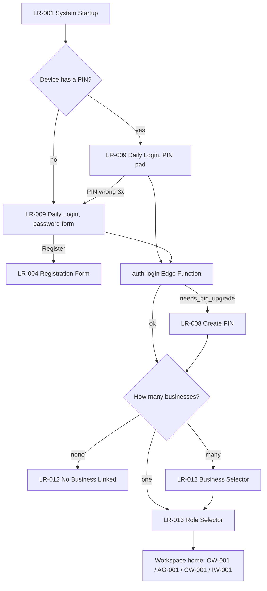
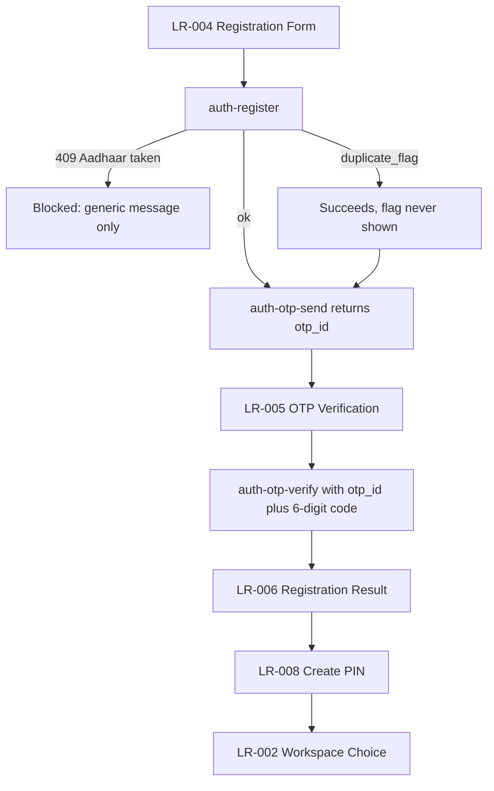
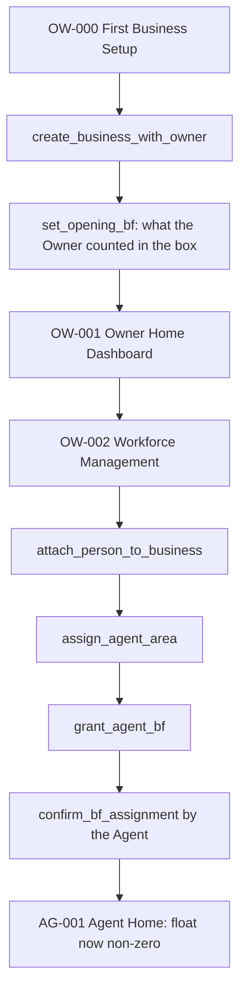
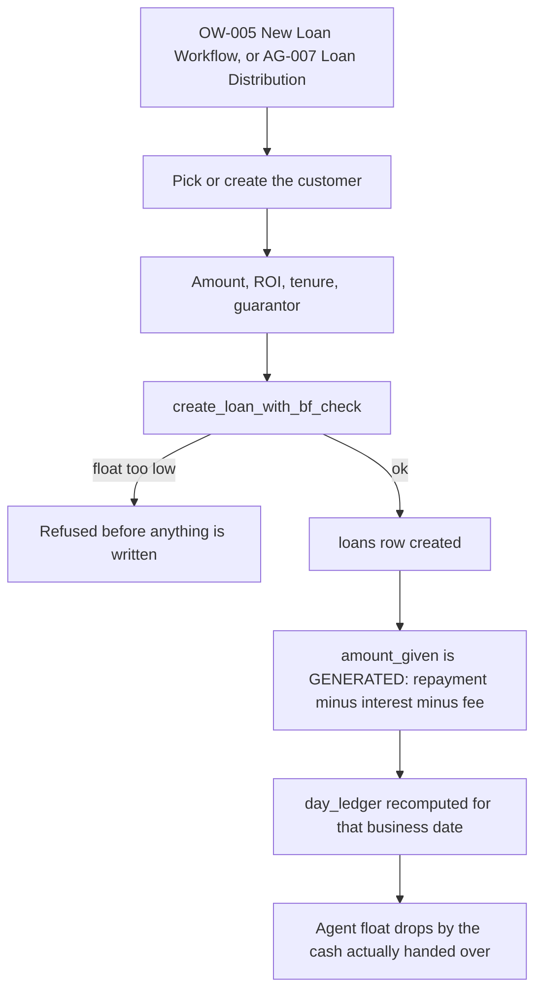
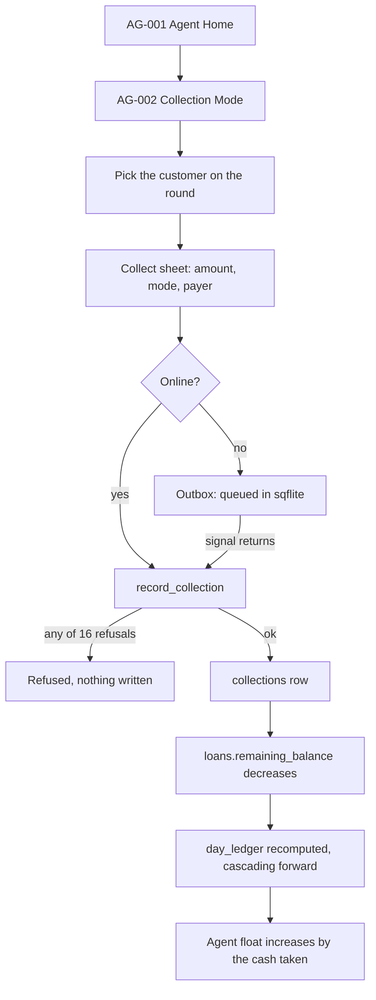
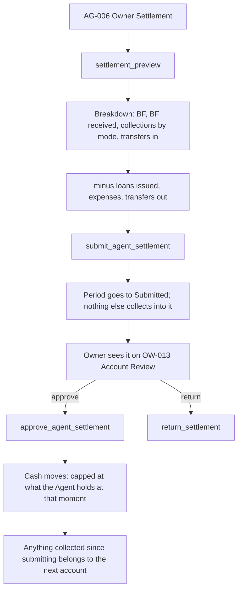
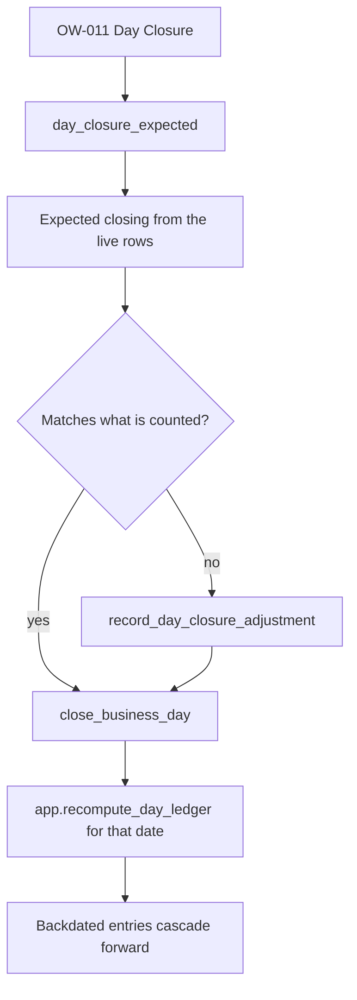
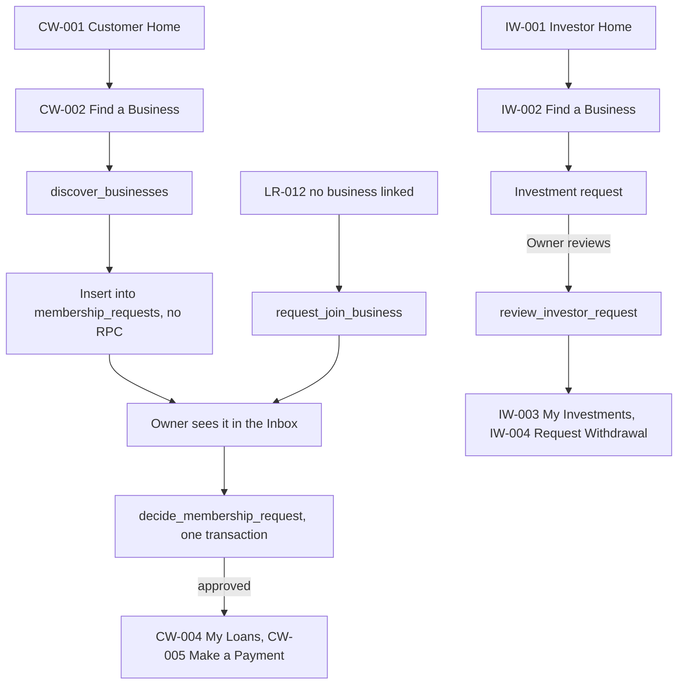

# APP FLOWS — how a journey actually runs

Companion to `docs/APP_MAP.md`. That file is the index: which file serves
`/ow-005`, what it takes, who reaches it. It is generated, so it is always
true and never explains anything.

**This file is the narrative.** It covers the eight journeys the app exists
for, what moves in the database at each step, and what refuses. It is
hand-written, and it is about business rules rather than pixels, which is
why it can be hand-written without rotting: the shape of a settlement has
not changed in the life of this project, while the screen that draws it has
changed many times.

**Screen IDs below are links into the map.** When a step names `AG-002`,
`docs/APP_MAP.md` tells you the file, the arguments and the callers.

---

## 1. First contact — startup, login, PIN

**What is actually happening.** `auth-login` is an Edge Function, not
GoTrue. It compares the submitted PIN against `persons.pin_hash`
**server-side** and mints a custom JWT carrying a `person_id` claim.
`main.dart`'s `Supabase.initialize(accessToken: ...)` attaches that token to
every later request, and RLS reads the claim through
`app.current_person_id()`.

**Three things here are not obvious and have each caused a bug:**

- **LR-007 and LR-009 are one screen.** `/lr-007` still exists and still
  takes every argument it used to; it opens `DailyLoginScreen` already on
  the password form. `FirstLoginScreen` is embedded inside it rather than
  being a route of its own.
- **The PIN is never validated on the device.** An earlier version compared
  the entered PIN against a copy in `flutter_secure_storage` — which proves
  "same device", not "a human knows the PIN". The local copy now only gates
  the biometric convenience path.
- **The token expires after an hour**, and the expiry callback clears it and
  bounces to `/lr-009`, which re-mints. A screen that seems to log the user
  out mid-round is usually this, working correctly.

---

## 2. Registration

**SP-001 confidentiality is enforced in this flow.** Two different
"duplicate" signals come back and they are treated differently on purpose: a
soft `duplicate_flag` (a BR-228 fuzzy match) lets registration succeed and is
**never shown** to the person registering, because showing it turns the form
into an identity-fishing tool. A hard 409 on the `aadhaar_number` unique
index blocks registration and says only that the Aadhaar is already
associated with an account — never whose.

**`generateOtpCode()` currently returns a fixed `123456`** and is deployed
that way, because there is no SMS gateway. See `docs/HANDOVER.md` §6. The
client contract — send returns an `otp_id`, verify takes `otp_id` plus a
six-digit code — does not change when a real gateway lands.

**You cannot reach the OTP screen without an OTP having been sent.**
`test/otp_navigation_guard_test.dart` enforces it.

---

## 3. Owner starts a business, and funds an agent

**`opening_bf_declared_amount` is the seed for day one, and never
`owner_bf_balance`.** Seeding from a running total was the original defect
in this app's ledger: it drifted every time cash moved, and
`recompute_day_ledger_onward()` only walks forward, so the seed row was never
revisited. One business carried a phantom ₹10,00,000 across every ledger day
that way.

**A BF grant moves cash between pots without changing the total**, which is
why it does not touch `day_ledger`. The same is true of an agent-to-agent
transfer and of a settlement handover.

**An agent has to confirm a grant.** Until `confirm_bf_assignment` runs, the
money is in transit and belongs to neither float.

---

## 4. Issuing a loan

**Interest and fee never leave the till.** `amount_given` is a **GENERATED**
column — `repayment − interest − fee` — so the customer receives less than
the loan is worth, and the difference was never cash in anyone's hand. Never
write `amount_given`. Adding interest and fee back to BF double counts, which
`test/migration_loan_math_test.dart` pins by name, both the right answer and
the wrong one.

**ROI is ₹ per ₹100 per month**, not an annual rate. Daily interest is
`principal × (roi/100) / 30` on a 30-day month, rounded CEILING to whole
rupees because every money column is `numeric(_,0)` and paise cannot be
stored. Yearly compounding uses actual calendar days, 365 or 366.

**The float gate is a pre-flight check inside the RPC**, not a screen
validation. The two non-negative CHECK constraints on the BF columns were
dropped on purpose — a derived figure must be allowed to state the truth —
so `create_loan_with_bf_check`, `record_expense`, `grant_agent_bf` and
`record_cheti_payment` are what actually stop new spending from going
negative.

---

## 5. The collection round — the path the app exists for

**`record_collection` is not a write — it is sixteen refusals wrapped around
a write.** Seven of them the device could check for itself (a positive
amount, splits that sum, a guarantor id when the payer is a guarantor, no
future date, nothing before the loan was issued). Nine depend on state the
device cannot see: whether the receipt still exists, whether it belongs to
this loan, whether it is from a different collection window, whether this
person is the borrower, whether you are authorised to collect on this loan.
That split is the whole reason offline is an architectural change and not a
caching problem — `docs/decisions/2026-09-15-offline.md` has the full list.

**Offline today reaches exactly one screen.** `lib/shared/outbox/` is real —
a sqflite store, a watcher, a provider, a banner and `/outbox` — and
`ow_006_collection_mode.dart` is its only consumer. Task 7 of the
production-readiness plan is the rest.

**A collection at 00:30 IST belongs to that Indian business day.** Use
`manaBusinessDate()`. Deriving the date from UTC files money against the
wrong day.

**One `remaining_balance` per loan.** No waterfall; payments subtract.
Nothing accrues between them — there is no interest engine yet.

---

## 6. Settlement — submit asks, approve pays

**Before this, submit did the moving.** It zeroed the Agent's float and
credited the Owner while writing the row as "Pending Owner Review" — so the
Owner was approving something that had already happened. Submit now records
and notifies; approve moves.

**Interest and processing fee are earnings, not cash the Agent holds.**
`settlement_preview` returns them and the settlement total excludes them.
Both were withheld at disbursement, so they never passed through the Agent's
hands, and the interest a customer repays is already inside the collection
figure. Listing them as income counts it twice and the total stops matching
the money in the tin.

**A breakdown must reach its own total.** The first version was ₹70 short
because it missed BF the Owner had granted mid-round. Seventy rupees is
exactly the size of gap that teaches somebody to stop reading the breakdown.

**A settled period does not change behind somebody's back** — see the recent
commits on period protection.

---

## 7. Day closure and the ledger

**`day_ledger` is recomputed, never incremented.** Triggers on all eight
source tables call `app.recompute_day_ledger()`, which rebuilds the day from
scratch. Incrementing drifts: a failed retry double-counts and a deleted row
never un-counts. One day's closing is the next day's opening, so a backdated
entry cascades forward by design.

**BF is derived, not stored as a running total.**
`app.recompute_agent_bf()` recomposes an agent's cash from its events;
`app.recompute_business_bf()` sets `owner_bf_balance` to the latest
`day_ledger` closing minus what the agents hold. Delete and restore both move
BF correctly because neither has to remember to.

**But a signed-off period does not move at all** (2026-09-17). The cascade
above is why: deleting one six-month-old collection used to rewrite every
closing balance from that day to today — including days already **closed**,
whose `day_closures` row kept the counted cash and the zero difference it was
signed off on. The two would disagree and nothing said so.

`app.soft_delete_record` and `app.restore_record` now call
`app.locked_period_reason()` **before any write**, and refuse when the record's
business date falls on a `Closed` day or inside a `Submitted`/`Approved`/`Locked`
account period. Both directions are guarded: restoring moves the same money the
other way through the same recompute, so guarding only the delete would leave
the hole open in reverse — delete while the period is open, restore once it is
settled.

**Know the dead end before you meet it:** a settlement can be returned
(`app.return_settlement`), but **there is no reopen for a business day**.
`app.close_business_day` reads `reopened_at` and nothing in the schema ever
sets it. So a closed day is currently uneditable rather than
editable-after-a-deliberate-step. That is a known, named gap, not an oversight
— and it is the first thing to build if anyone starts closing days.

**A loan's status follows its balance** (2026-09-17), by a trigger rather than
by any one RPC remembering to. Seven functions assign `remaining_balance` and
only `close_loan` ever set a status, so a loan paid to zero stayed `Active` for
ever and kept appearing in the round. `trg_loans_status_follows_balance` closes
it at zero — recognising any pending penalty as income on the way, which is
what `close_loan` did manually — and **reopens it** if a deleted collection
gives the money back. `Cancelled` and `Defaulted` are never touched: those are
decisions a person made, not facts about a balance.

---

## 8. Customer, investor, and asking to join

**There are two doors into the same queue.** A customer who found a
business asks from CW-002, which inserts a `membership_requests` row
directly — an RLS self-insert policy allows it, so no RPC is involved. A
person with no business linked asks from LR-012 through
`app.request_join_business`. Both arrive in the Owner's Inbox
(`lib/shared/inbox_service.dart`), and `app.decide_membership_request` does
the approval in one transaction. There is no dedicated approval screen: the
Inbox is it.

**This path was locked for months and the fix delivered real people into
it.** Repairing Request-to-Join meant an approval flow that had never run
and a screen that crashed on a null embed both got their first traffic on
the same day. When a fix makes an unreachable path reachable, walk the whole
path.

**A withdrawal is a money path with a specific, expensive history.** One
validated against a computed principal and subtracted from a stale stored
one; it would have destroyed ₹91,250 of an investor's money, and was caught
only by selecting `principal_amount` after the call and reading it.

---

## 9. Where things go — the placement rules

These govern every screen in the app. They are here rather than repeated per screen
because a per-screen description of button positions is the fastest-rotting
document anybody could write, and the screen file itself is the better read.
(Do not expect it to be short: across the 73 screen files the median is 408
lines and nine are over 1,000 — `ow_012_business_management.dart` is 2,392.
The long ones are the oldest and the most worth splitting.)

**Chrome is assembled by components, never by the screen.**

| Slot | Component | Rule |
|---|---|---|
| Top bar | `ManaAppBar` | A title, back, actions, and a bottom slot for tabs or a filter row. Anything more belongs in the body. |
| Back | `ManaAppBar` | Pop what is there; fall back to `homeRoute` only when there is nothing. Screens **state** where home is, they do not implement going there. |
| Trailing actions | `ManaAppBar.trailingActionsBuilder` | Notifications, add expense, search — set once by the app layer, decided from the current route. No screen assembles them. |
| Bottom nav | `ManaWorkspaceNav` | Home, Collections, Customers, History, in that order, in both Owner and Agent workspaces. Collections is second because that is where the day is spent. |
| Money | `ManaAmount`, `ManaMoneyRow` | Tabular figures. Never `textSecondary` for a money figure. |
| Identity | `ManaIdentityHeader` + `ManaVerificationRing` | See below. |
| Status | `ManaStatusPill`, `ManaTrailingStatus` | Status vocabulary is the spec's own — Balanced/Short/Excess, Active/Penalty/Grace. No invented statuses. |

**Why the chrome is centralised at all:** there were 79 app bars across 65
files, and 30 of them carried a hand-written
`BackButton(onPressed: () => context.go('/ow-001'))`. Those were not a style
choice — `go()` replaces the router stack, so there was often nothing to pop
and each screen had to name its own way home. When one named the wrong home,
an Agent ended up on the Owner's dashboard.

**The Verification Ring is the app's signature, and it carries three
independent meanings** (BR-191/GC-002, `ManaVerificationRing` in
`lib/design/components/mana_text.dart`):

1. **Colour, by default, means identity verification** — green or red, from
   `persons.verification_ring`. Twenty-two call sites; eight take the
   default.
2. **`ringColor`, opt-in, overrides that colour.** Fourteen sites pass it,
   and they mean two different things — so read which before you copy one:
   **thirteen** pass `ManaColors.textSecondary` for *verification unknown*
   (the model never fetched the column, and `null` must not be drawn as
   "unverified"), and **one**, `ow_012_business_management.dart:2067`, uses
   it for membership status on the business roster — green active, red
   suspended, orange removed.
3. **Sweep, opt-in, means how complete the record is** — `completeness`
   0.0–1.0 from `app.profile_completeness`, drawn as an arc that closes at
   five of five. Independent of colour, which is the whole reason it is a
   sweep: a half-drawn green ring says verified AND half-known.

   Do not add a fourth meaning as a colour. The note in `mana_text.dart`
   records why sweep was chosen instead, and sixteen sites once drew the
   colour from a hardcoded `isVerified: true` — the failure that costs most
   here is a ring that asserts something nobody asked the database.
3. **`completeness`, 0.0–1.0, is a third channel, not a third colour** — how
   complete a profile is, drawn clockwise from the top like a gauge. A
   half-drawn green ring still says verified; it also says half-known.

**Colour rules that are load-bearing, not taste** (`lib/design/tokens/colors.dart`):

- **Blue is the brand, not the text colour.** Saturated blue is the worst
  choice for body text — the eye focuses it least sharply, blue subpixels
  are dimmest on AMOLED, and the lens yellows with age, so an older Owner
  sees it duller than a younger Agent does. Brand `#007ACC` is for large
  text, icons and fills; body text is `#12293D`.
- **The status pair is CVD-safe on purpose.** Teal `#00695C` keeps a strong
  blue channel and orange-red `#CC3311` has almost none, so they separate on
  the blue-yellow axis that red-green colour blindness leaves intact, and
  they differ in luminance so they survive greyscale. **Colour is never the
  only signal** — always pair with an icon or a label.
- **Dark mode is not an inversion.** Flipping luminance would collapse the
  CVD split, and these two carry money meaning. Surfaces are blue-tinted
  charcoal rather than pure black, because OLED black smears on the cheap
  LCD panels this app actually runs on.
- **`accent` `#FFB616` is a fill colour, not an ink colour** — 1.76:1 on
  white, invisible outdoors as text. `statusWarn` is deliberately deep
  enough never to read as a tappable action beside it.

**Spacing and radius** come from `ManaSpacing` (4/8/12/16/24/32) and
`ManaRadius` (6/12/20, plus `ring: 999`). Cards use the quieter `md` so the
ring stays the signature.

**Text is Title Case, enforced in code.** `ManaText` does it; `ManaText.raw()`
is the carve-out for free text and system IDs. Do not hand-case a label.

**Every layout must survive Telugu at 2.0× text scale on a 360×640 surface.**
Overflow has shipped four times and the cause is always the same: a bare
unflexible child beside a flexible one. `expectNoLayoutFault` in the harness
is the check; `adb logcat | grep overflowed` is the only reliable one on
device.

---

## 10. Adding a screen — the checklist

1. **Take the next locked screen ID** for that workspace. The ID is the
   contract: one ID, one route (`/ow-020`), one file
   (`lib/features/owner_workspace/screens/ow_020_*.dart`).
2. **Register exactly one route** in `lib/app/router.dart`. If the web build
   should carry it too, add it to `lib/app/web_router.dart` *and* to
   `kManaWebAllowedRoutes` — `test/web_router_guard_test.dart` fails on
   drift between the two.
3. **Screen reads `ref.watch`, calls `ref.read(...notifier)`.** It never
   touches Supabase. The API service does, and it lives in `state/`.
4. **Every new `ref.t('key')` needs a translation migration in the same
   change**, or `test/translation_keys_exist_test.dart` fails.
5. **If it embeds across two tables that share more than one FK, name the
   FK** or PostgREST answers PGRST201 and the screen just says it could not
   load. Eleven such pairs; `test/ambiguous_embed_guard_test.dart` holds
   them.
6. **If it calls a new RPC**, regenerate `test/support/schema_snapshot.dart`
   (the query is in its header) and count the overloads — the answer must be
   1.
7. **Write the layout test**, seeding the provider if the screen loads in
   `initState`, and pump it at the route it really renders at — the header's
   trailing actions are decided from the current route, so a test pumped at
   `/` lays out a different bar.
8. **Run `dart run tool/gen_app_map.dart`** so the inventory keeps up.
   `test/app_map_sync_test.dart` fails if you forget.

---

## Where this file is wrong

It will be, eventually, in a way `docs/APP_MAP.md` cannot be. The flows are
business rules and they move slowly, but they do move.

When you find a step here that no longer matches the code, **fix it in the
same change that moved the code**, and say in the commit message what moved
and why. That is how everything else in this repo stays honest: the reason
is written down next to the thing, at the moment somebody knew it.
